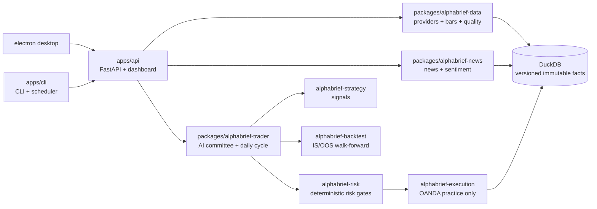

<!-- Recruiter TL;DR. The authoritative engineering README below is intentionally unchanged. -->

## Recruiter TL;DR

> A local-first market-data and paper-trading platform that turns multi-source data into reproducible research, backtests, risk-gated OANDA practice execution, and auditable operational evidence.

[](LICENSE)
[](pyproject.toml)
[](#current-verified-baseline)

### What this demonstrates for a Data Engineer

- **Multi-provider ingestion:** market, news, and macro inputs flow through dedicated `data` and `news` packages with provenance tracking, quality checks, and structured provider boundaries (Yahoo, Binance, Alpha Vantage, RSS, SEC, FRED).
- **Reproducible storage:** versioned, immutable market and order facts are persisted in DuckDB, keeping research, reconciliation, and replay inspectable.
- **Reliable orchestration:** the daily scheduler uses a persisted compare-and-set state machine, a renewable leader lease, restart-resume at every phase boundary, and at-most-once external execution with correlation chains.
- **Auditability by design:** every cycle is recorded end-to-end — evidence, model calls, proposals, risk decisions, orders, transactions, and reconciliation — with deterministic acceptance gates.
- **Tested contracts:** the published baseline records **1,389 passing tests**, and the current main collects **3,325 tests** across API, CLI, data, strategy, risk, execution, and acceptance boundaries (static local baseline — no CI workflow yet).



### Repository map

- [Agent contract](AGENTS.md)
- [Final product blueprint](ALPHABRIEF_PRODUCT_BLUEPRINT.md)
- [Current progress ledger](docs/progress.yaml)
- [Architecture](docs/architecture.md)
- [Acceptance and traceability](docs/acceptance.md)

---
# AlphaBrief

AlphaBrief is a local-first market research and paper-trading workstation. It
combines market/news/macro ingestion, structured model research, strategy and
backtest tooling, deterministic risk checks, broker execution, scheduling,
audit storage, a FastAPI/CLI surface, and a local Electron dashboard.

The approved final target is narrower than the historical codebase:
**OANDA v20 practice only, no Alpaca, no live trading, and no silent simulated
broker fallback**. The migration is planned in the final blueprint and is not
yet complete.

- M09 content pipeline (DONE): deterministic news ingestion with provenance and copyright-safe retention, URL canonicalization + deduplication + entity linking, revision-aware macro calendar, explainable multi-scope sentiment aggregation, untrusted external content sanitization, and immutable daily regime/sentiment snapshots shared by research and risk.
- M10 ModelGateway and committee closure (DONE): exclusive ModelGateway boundary with fail-closed production composition (no FakeProvider fallback), durable per-call records and budgets, five-role multi-turn committee with evidence-grounded transcripts, strict research proposals with grounding validation, bounded structured-output repair, cycle-key idempotency, and security/quality evaluation gates.
- M11 durable daily cycle and scheduler truth (DONE): persisted compare-and-set cycle state machine (preflight, ingest, snapshot, discuss, propose, risk, execute or no-trade, reconcile, report, complete) with restart-resume at every phase boundary, renewable scheduler leader lease, one persisted runtime truth for API/CLI status, research/execution separation with deterministic preflight modes, bounded candidate selection, catch-up windows and terminal no-trade outcomes, at-most-once execution with correlation chains and immediate reconciliation, and reproducible daily evidence reports.
- M12-M15 (DONE): read/write contracts, strategy backtest closure, dashboard redesign, and engineering readiness. The frozen build is OANDA practice-only with no live path, no Alpaca, no simulated fallback; security gates enforce the network allowlist (api-fxpractice.oanda.com, stream-fxpractice.oanda.com only).
- M16 observation contracts (DONE, evidence PENDING): Day 0 commissioning manifest, 14-kind daily evidence chains, weekly gates with five zero-difference invariants, qualified non-trading outcomes, applicability/continuity accounting, fault-injection and isolated-restore drills, Day 30 close, and the final 30-day gate. Runtime commands (`observation verify-window/drill/weekly-gate/day-30-gate/finalize`, `observation verify --final`) report honest BLOCKED_EXTERNAL/WAITING_EXTERNAL states until real OANDA practice T7 evidence and the frozen Day 0 manifest exist; no observation day is ever fabricated.
- M17 final handoff (DONE, evidence PENDING): evidence-derived final acceptance report (json + markdown, deterministic manifest hash, secret/waiver/TBD/live-claim redaction), fresh-install readiness and operator runbook contracts, deterministic Electron packaging with checksum manifest and packaged smoke/security gates, final acceptance traceability (4 levels, 5 flaws rejected) and the 11-gate final release gate whose only completion status is `COMPLETE_PAPER_ONLY`. Every command fails closed and reports honestly; the project status stays IN_PROGRESS until real OANDA practice T7 evidence exists.
## Current Verified Baseline

Snapshot: 2026-08-14, commit `0a1016a` (all M01-M17 work items closed as contracts; real 30-day observation and final release evidence pending T7 practice credentials; project status IN_PROGRESS).

| Area | What exists now | Important limitation |
|---|---|---|
| Market data | CSV/Parquet loaders, Yahoo/Binance/Alpha Vantage providers, quality checks, features, DuckDB storage with versioned immutable bar facts | OANDA account-wide discovery is not complete (M04); providers are not OANDA-native |
| News and macro | RSS, SEC, FRED, mock/social-sentiment providers, storage and brief inputs | Daily production freshness, source reliability, sentiment calibration, and untrusted-content defenses are incomplete |
| Models | ModelGateway, Fake/OpenAI/Ollama adapters, structured output, evaluation/router, Kronos interface, durable call records and budgets | Production composition fails closed without a real provider; evaluation defaults to the configured provider |
| Research | Daily briefs, evidence objects, multi-role debate, AI trading committee, multi-turn evidence-grounded transcripts and proposals, reproducible daily cycle reports | Durable cycle is wired end-to-end; OANDA practice runtime evidence lands with M15/M16 |
| Strategy/backtest | Safe compiled condition DSL (typed AST, allowlist, no arbitrary code), five category-aware strategy families with machine-enforced OANDA-category admission, OANDA-semantic portfolio simulation (spread, slippage, financing, margin, unit constraints, explicit rejections), reproducible IS/OOS rolling and anchored walk-forward with run IDs and frozen parameters, research-grade metric and attribution reports, automated leakage/overfitting/advisory-boundary gates | API IS/OOS and backtest/strategy read surfaces land in M13; T7 practice backtest evidence pending (local deterministic gates only) |
| Risk | Symbol/order/exposure/loss/drawdown/news-aware rule primitives | AI auto-execution does not yet pass the full account and news context into every RiskGate call |
| Execution | In-memory paper broker (explicit local mode), OANDA practice adapter, shared process runtime, reconciliation stores | M01 cutover complete: OANDA practice is the only execution venue; OANDA lifecycle coverage, persistence, and reconciliation are incomplete |
| Operations | Scheduler, heartbeats, alerts, API/CLI, nine dashboard pages, Electron wrapper; versioned storage migrations, writer lease, and verified backups | Scheduler/control-plane truth, observability, and 30-day evidence are incomplete |
| API/CLI contracts | Shared versioned read contracts (14 domains) and safe idempotent operator write contracts (7 approved mutations with audit), operational portfolio/equity resources and cycle traceability from shared runtime stores, machine-readable CLI contracts (deterministic exit codes, stable JSON, no prompts), deterministic locked OpenAPI with API-CLI parity | Dashboard redesign lands in M14; T7 practice evidence pending (local deterministic gates only) |

At the baseline, the repository exposed 18 CLI command groups with 57
subcommands, 86 OpenAPI endpoints, and nine dashboard routes. The quality run
produced 1,389 passing tests plus 12 local-HTTP test failures caused by the
restricted sandbox refusing a `127.0.0.1` bind; Ruff and Mypy passed. These are
baseline facts, not final acceptance.

## Final Product Boundary

The completed product must:

1. use only a configured OANDA practice account for external execution;
2. discover the account's actual tradable instruments dynamically instead of
   promising a hard-coded regional catalogue;
3. cover every asset category returned as tradable by that account, including
   currencies, metals, and any index, commodity, bond, crypto, or share CFDs the
   account/division exposes;
4. ingest fresh market data, financial news, macro context, and market
   sentiment every day;
5. persist an auditable multi-role AI discussion and a structured `no_trade` or
   `OrderIntent` result;
6. require a deterministic, persisted RiskDecision before any OANDA order;
7. support the necessary OANDA order, trade, position, transaction, pricing,
   and reconciliation lifecycle without duplicate orders after retries or
   restarts;
8. provide CLI, API, Soft-style responsive dashboard, alerts, recovery, and
   evidence generation;
9. survive a real 30-calendar-day OANDA practice observation period;
10. keep live trading permanently unreachable.

Instrument availability varies by OANDA legal division and account. AlphaBrief
therefore treats `GET /v3/accounts/{accountID}/instruments` as the authority and
must show unsupported categories honestly rather than emulate them elsewhere.

## Repository Layout

```text
apps/
  api/                     FastAPI and dashboard
  cli/                     Typer CLI and scheduler entry points
packages/
  alphabrief-core/         domain schemas and policy
  alphabrief-data/         bars, providers, quality, features
  alphabrief-news/         news and sentiment ingestion
  alphabrief-models/       ModelGateway and model adapters
  alphabrief-research/     briefs and debate
  alphabrief-strategy/     strategy specifications and signals
  alphabrief-backtest/     backtesting and metrics
  alphabrief-risk/         deterministic risk gate
  alphabrief-execution/    paper/OANDA execution and operations
  alphabrief-trader/       AI committee and daily cycle
  alphabrief-gym/          training environments
  alphabrief-review/       post-trade review
  alphabrief-acceptance/   deterministic project gates
electron/                  local desktop wrapper
config/                    non-secret policy and OANDA practice config
docs/                      authoritative development and operating documents
tests/                     unit, integration, contract, and acceptance tests
```

## Local Setup

Requirements: Python 3.12+, a virtual environment, and Node.js only when using
the Electron wrapper.

```bash
python3.12 -m venv .venv
.venv/bin/python -m pip install -e '.[dev]'
cp .env.example .env
```

Never put credentials in tracked YAML or source files. For an external practice
account, set these in the runtime environment:

```bash
ALPHABRIEF_OANDA_TOKEN=...
ALPHABRIEF_OANDA_ACCOUNT_ID=...
```

Until milestone M01 removes the historical routes, do not assume that all
runtime surfaces are already OANDA-only. Follow the current status in
`docs/progress.yaml`.

## Common Commands

```bash
.venv/bin/alphabrief --help
.venv/bin/alphabrief serve serve
.venv/bin/alphabrief scheduler status
.venv/bin/alphabrief acceptance verify --compact
.venv/bin/python -m pytest -q
.venv/bin/ruff check .
.venv/bin/mypy
```

The Electron shell is optional:

```bash
cd electron
npm install
npm start
```

## Authoritative Documents

Read in this order when developing:

1. [Agent contract](AGENTS.md)
2. [Current progress](docs/progress.yaml)
3. [Final product blueprint](ALPHABRIEF_PRODUCT_BLUEPRINT.md)
4. [Machine work queue](docs/work_items.yaml)
5. [Autonomous loop protocol](docs/autonomous_loop.md)
6. [Current and target architecture](docs/architecture.md)
7. [Acceptance and traceability](docs/acceptance.md)
8. [OANDA 30-day runbook](docs/oanda_30_day_runbook.md)

Old phase plans, development logs, duplicated risk/model notes, and snapshot
acceptance reports were intentionally removed. Git history is the archive.

## Safety Notice

AlphaBrief is research software, not financial advice. The repository is
designed for paper trading only. Do not connect it to a live endpoint or use
practice results as evidence of future profitability.
