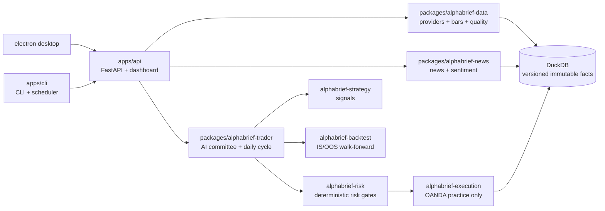

# AlphaBrief

> **A local-first data pipeline for market, news, and macro research — ingest from multiple providers, version immutable facts in DuckDB, and run a durable daily cycle with restart-resume and at-most-once OANDA practice execution.**

[](LICENSE)
[](pyproject.toml)
[](#current-verified-baseline)

I built this to learn how a real data platform handles messy external inputs: different market APIs that fail in different ways, news that needs deduplication and sanitization, and a daily workflow that has to survive restarts without duplicating orders. Every external call is isolated behind a provider boundary, every bar and trade is versioned, and every cycle leaves an audit trail I can replay.



### What this demonstrates for a Data Engineer

- **Multi-provider ingestion** — market (Yahoo, Binance, Alpha Vantage), news (RSS, SEC EDGAR), and macro (FRED) flow through isolated provider modules with a shared retry policy (exponential backoff, jitter, only 429/418/5xx retried) and strict error codes.
- **Reproducible storage** — bars, news items, and order facts are appended immutably in DuckDB with versioned migrations (`apps/api/src/alphabrief_api/db/`). Nothing is mutated in place, so research and reconciliation can be replayed.
- **Reliable orchestration** — the daily cycle is a persisted compare-and-set state machine (preflight → ingest → snapshot → discuss → propose → risk → execute/no-trade → reconcile → report) with a renewable leader lease and restart-resume at every phase boundary. External OANDA calls are at-most-once with correlation chains.
- **Auditability by design** — evidence, model calls, proposals, risk decisions, orders, transactions, and reconciliation are recorded end-to-end with deterministic gates. No observation day is ever fabricated; missing T7 credentials surface as `BLOCKED_EXTERNAL`.
- **Tested boundaries** — the verified baseline has **1,389 passing tests**; current `main` collects **~3,025 tests** across API/CLI/data/strategy/risk/execution (local static count, no CI yet).

### Why I built this

I kept hitting the same problem in market-data scripts: each provider had its own quirks, failures were silent, and a restart midway through a day would either skip work or duplicate orders. I wanted a single place where ingestion is explicit, failures are classified, storage is immutable, and the scheduler can be killed and resumed without losing track. The committee/LLM part is secondary — the data platform is the point.

### What it does, concretely

- Discovers tradable instruments from the configured OANDA practice account (`GET /v3/accounts/{id}/instruments`) instead of hard-coding a catalog.
- Ingests bars via `alphabrief-data` providers (CSV/Parquet loaders + Yahoo/Binance/Alpha Vantage) with `check_bar_quality` (duplicate timestamps, non-increasing, mixed symbols, zero volume, gap detection).
- Ingests news via `alphabrief-news` (`fetch_and_ingest`): canonical URL, published/fetched UTC, content hash, bounded summary, `fetch_outcome` in `success/empty/timeout/rate_limit/malformed/source_failure`; copyright-safe retention (metadata-only sources never store full text) and sanitization before research/risk see it.
- Versions everything in DuckDB (`db/schema.py` + `db/migrations.py` transactional, idempotent).
- Runs a daily cycle (`alphabrief-trader/cycle_state.py`, `cycle_execution.py`, `scheduler_leader.py`) that is fully persisted; killing the process and restarting resumes the same phase.
- Applies deterministic `RiskGate` before any `OrderIntent` reaches OANDA practice; reconciliation freezes execution on unexplained differences.
- Keeps live trading permanently unreachable — only `api-fxpractice.oanda.com` and `stream-fxpractice.oanda.com` are allowlisted.

### Engineering highlights

**Provider boundaries.** `providers/base.py` defines `RetryPolicy` (max_retries, initial_backoff, factor, jitter) and `call_with_retry` that only retries 429/418/5xx and transient network errors. Each provider returns `Bar` lists and never calls a third-party SDK directly; tests inject a fake `http_get` callable so no real network is needed.

**Data quality.** `quality.py` checks identity consistency (mixed symbols/sources/versions), timestamp ordering (duplicates, non-increasing), expected interval gaps, and zero volume. `phases` are `error` vs `warning` so pipelines can decide to block or just warn.

**News provenance.** `news/ingestion.py` persists `item_id, source, canonical_url, published_at, fetched_at, content_hash, summary, fetch_outcome, correlation_id, metadata_only` with `INSERT OR IGNORE`; daily regime/sentiment snapshots are immutable and shared by research and risk.

**Durable cycle.** `cycle_state.py` stores `phase, phase_order, output_ids` with `ON CONFLICT DO UPDATE`; `scheduler_leader.py` uses a renewable lease so only one scheduler runs. At-most-once is enforced via idempotency keys and immediate reconciliation after every OANDA call.

### Limitations — honest state

- OANDA account-wide discovery is not complete (M04); current providers are not OANDA-native, so production bars still come from Yahoo/Binance/Alpha Vantage.
- Production freshness, source reliability, and sentiment calibration are incomplete — daily runs work locally but are not yet proven over 30 real days without manual watch.
- Model composition fails closed: without `OPENAI_API_KEY` or `OLLAMA_*`, `ModelGateway` refuses; `FakeProvider` exists only in tests.
- The daily cycle is end-to-end wired, but T7 practice runtime evidence for M15/M16 (30-day observation, weekly zero-difference invariants, fault drills) is still pending real credentials. Commands report `BLOCKED_EXTERNAL` / `WAITING_EXTERNAL` honestly.
- Strategy DSL is safe (typed AST allowlist, no arbitrary code) and backtests are reproducible with frozen params, but API surfaces for IS/OOS and strategy reads landed in M13 and still need T7 evidence.
- Execution is OANDA practice only; Alpaca and live paths were removed and must stay removed. Missing credentials fail closed — no silent in-memory fill is ever presented as an OANDA fill.

<details>
<summary>Milestone contract status (M09–M17) — contracts closed, T7 evidence pending</summary>

- M09 content pipeline (DONE): deterministic news ingestion with provenance, URL canonicalization + dedup + entity linking, revision-aware macro calendar, multi-scope sentiment, untrusted sanitization, immutable snapshots.
- M10 ModelGateway (DONE): exclusive gateway, fail-closed composition, durable call records/budgets, five-role committee, grounded proposals, bounded structured-output repair, cycle-key idempotency.
- M11 durable cycle (DONE): persisted CAS state machine with restart-resume every phase, leader lease, single runtime truth, research/execution separation, bounded candidate selection, catch-up windows, terminal no-trade.
- M12–M15 (DONE): read/write contracts, strategy backtest closure, dashboard redesign, engineering readiness. Frozen build is OANDA practice-only; network allowlist enforced.
- M16 observation (DONE, evidence PENDING): Day 0 manifest, 14-kind daily chains, weekly gates, fault drills, Day 30 close.
- M17 handoff (DONE, evidence PENDING): evidence-derived final acceptance report, fresh-install/runbook, deterministic Electron packaging, 11-gate final release (`COMPLETE_PAPER_ONLY`).

</details>

## Current Verified Baseline

Snapshot: 2026-08-14, commit `0a1016a` (all M01–M17 closed as contracts; 30-day observation pending T7 credentials; status `IN_PROGRESS`).

| Area | What exists now | Important limitation |
|---|---|---|
| Market data | CSV/Parquet loaders, Yahoo/Binance/Alpha Vantage providers, quality checks, features, DuckDB storage with versioned immutable bar facts | OANDA discovery not complete; providers not OANDA-native |
| News and macro | RSS, SEC, FRED, mock/social-sentiment providers, ingestion store with provenance | Production freshness and untrusted-content defenses incomplete |
| Models | ModelGateway, Fake/OpenAI/Ollama adapters, structured output, evaluation/router, durable call records | Production fails closed without real provider |
| Research | Briefs, evidence objects, debate, AI committee, daily cycle reports | Cycle wired end-to-end; runtime evidence pending |
| Strategy/backtest | Typed AST DSL, 5 strategy families with OANDA-category admission, spread/slippage/financing/margin simulation, IS/OOS walk-forward, leakage/overfitting gates | API surfaces in M13; T7 evidence pending |
| Risk | Symbol/order/exposure/loss/drawdown/news-aware primitives | Full account+news context not yet passed to every RiskGate call |
| Execution | In-memory paper broker (explicit local), OANDA practice adapter, reconciliation stores | OANDA lifecycle persistence and reconciliation incomplete |
| Operations | Scheduler, heartbeats, alerts, API/CLI, 9 dashboard pages, Electron; versioned migrations, writer lease, backups | 30-day evidence and control-plane truth incomplete |
| API/CLI contracts | 14 read domains, 7 idempotent operator writes with audit, 18 CLI groups / 57 subcommands / 86 OpenAPI endpoints / 9 dashboard routes, locked OpenAPI with CLI parity | Dashboard redesign in M14; T7 evidence pending |

Local quality at baseline: **1,389 passing tests + 12 local-HTTP failures from sandbox `127.0.0.1` bind refuse**; Ruff and Mypy passed. Current `main` collects **~3,025 tests** (21 collection errors without `httpx` — needs `pip install -e '.[dev]'`).

## Repository Layout

```text
apps/
  api/                     FastAPI and dashboard
  cli/                     Typer CLI and scheduler entry points
packages/
  alphabrief-core/         domain schemas and policy
  alphabrief-data/         bars, providers, quality, features
  alphabrief-news/         news and sentiment ingestion
  alphabrief-models/       ModelGateway and model adapters
  alphabrief-research/     briefs and debate
  alphabrief-strategy/     strategy specifications and signals
  alphabrief-backtest/     backtesting and metrics
  alphabrief-risk/         deterministic risk gate
  alphabrief-execution/    paper/OANDA execution and operations
  alphabrief-trader/       AI committee and daily cycle
  alphabrief-gym/          training environments
  alphabrief-review/       post-trade review
  alphabrief-acceptance/   deterministic project gates
electron/                  local desktop wrapper
config/                    non-secret policy and OANDA practice config
docs/                      authoritative development and operating documents
tests/                     unit, integration, contract, and acceptance tests
```

## Local Setup

Requirements: Python 3.12+, a virtual environment, and Node.js only for the Electron wrapper.

```bash
python3.12 -m venv .venv
.venv/bin/python -m pip install -e '.[dev]'
cp .env.example .env
```

Never put credentials in tracked YAML or source files. For an external practice account:

```bash
ALPHABRIEF_OANDA_TOKEN=...
ALPHABRIEF_OANDA_ACCOUNT_ID=...
```

Follow `docs/progress.yaml` for the current milestone; do not assume all surfaces are already OANDA-only until M01 is marked complete.

## Common Commands

```bash
.venv/bin/alphabrief --help
.venv/bin/alphabrief serve serve
.venv/bin/alphabrief scheduler status
.venv/bin/alphabrief acceptance verify --compact
.venv/bin/python -m pytest -q
.venv/bin/ruff check .
.venv/bin/mypy
```

Electron shell (optional):

```bash
cd electron
npm install
npm start
```

## Authoritative Documents

Read in this order when developing:

1. [Agent contract](AGENTS.md)
2. [Current progress](docs/progress.yaml)
3. [Final product blueprint](ALPHABRIEF_PRODUCT_BLUEPRINT.md)
4. [Machine work queue](docs/work_items.yaml)
5. [Autonomous loop protocol](docs/autonomous_loop.md)
6. [Current and target architecture](docs/architecture.md)
7. [Acceptance and traceability](docs/acceptance.md)
8. [OANDA 30-day runbook](docs/oanda_30_day_runbook.md)

Old phase plans and snapshot reports were intentionally removed; git history is the archive.

## Safety Notice

AlphaBrief is research software, not financial advice. The repository is designed for paper trading only. Do not connect it to a live endpoint or use practice results as evidence of future profitability.
