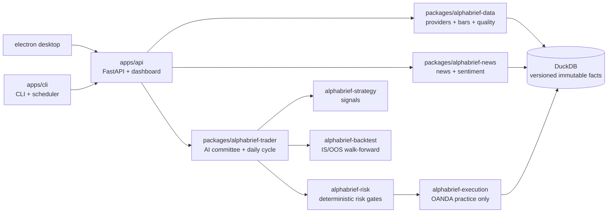

# AlphaBrief

A local-first data pipeline for market, news, and macro research. It ingests from multiple providers, versions immutable facts in DuckDB, and runs a durable daily cycle with restart-resume and at-most-once OANDA practice execution.

[](LICENSE)
[](pyproject.toml)
[](#current-status)

> **Status (2026-09-30): v1.0 rebuild in progress.** An audit showed that the code has never placed an order on the OANDA practice account, and that several pieces of the execution path were never wired together. The rebuild plan is in [docs/PROJECT_GUIDE.md](docs/PROJECT_GUIDE.md); live progress is in [docs/STATUS.md](docs/STATUS.md). The feature list below describes the code's design, not verified runtime behavior.


```mermaid
flowchart LR
    E[electron desktop] --> API[apps/api<br/>FastAPI + dashboard]
    CLI[apps/cli<br/>CLI + scheduler] --> API
    API --> DATA[packages/alphabrief-data<br/>providers + bars + quality]
    API --> NEWS[packages/alphabrief-news<br/>news + sentiment]
    DATA --> DB[(DuckDB<br/>versioned immutable facts)]
    NEWS --> DB
    API --> TRADER[packages/alphabrief-trader<br/>AI committee + daily cycle]
    TRADER --> STRAT[alphabrief-strategy<br/>signals]
    TRADER --> BT[alphabrief-backtest<br/>IS/OOS walk-forward]
    TRADER --> RISK[alphabrief-risk<br/>deterministic risk gates]
    RISK --> EXEC[alphabrief-execution<br/>OANDA practice only]
    EXEC --> DB
```

## Why I built this

Market-data scripts kept annoying me in the same way: every provider had its own quirks, failures were silent, and killing a run mid-day either skipped work or duplicated orders. I wanted one place where ingestion is explicit, failures are classified, storage is immutable, and a scheduler can be killed and resumed without losing track. The committee and LLM parts are secondary. The data platform is the point.

## What it does

- Discovers tradable instruments from the configured OANDA practice account (`GET /v3/accounts/{id}/instruments`) instead of hard-coding a catalog.
- Ingests bars through `alphabrief-data` providers (CSV/Parquet loaders plus Yahoo, Binance, Alpha Vantage), with `check_bar_quality` covering duplicate timestamps, non-increasing sequences, mixed symbols, zero volume, and gap detection.
- Ingests news through `alphabrief-news` (`fetch_and_ingest`): canonical URL, published/fetched UTC, content hash, bounded summary, and a `fetch_outcome` in `success/empty/timeout/rate_limit/malformed/source_failure`.
- Runs a persisted compare-and-set daily cycle: preflight, ingest, snapshot, discuss, propose, risk, execute or no-trade, reconcile, report. A renewable leader lease and restart-resume at every phase boundary keep a crashed run recoverable, and external OANDA calls are at-most-once with correlation chains.
- Records evidence end to end: model calls, proposals, risk decisions, orders, transactions, reconciliation. Missing credentials surface as `BLOCKED_EXTERNAL`; no observation day is ever fabricated.
- Appends bars, news items, and order facts immutably in DuckDB (`db/schema.py` plus `db/migrations.py`, transactional and idempotent), under versioned migrations in `apps/api/src/alphabrief_api/db/`. Nothing is mutated in place, so research and reconciliation can be replayed.
- Runs a persisted daily cycle (`alphabrief-trader/cycle_state.py`, `cycle_execution.py`, `scheduler_leader.py`); killing the process and restarting resumes the same phase.
- Applies a deterministic `RiskGate` before any `OrderIntent` reaches OANDA practice. Reconciliation freezes execution on unexplained differences.
- Keeps live trading permanently unreachable. Only `api-fxpractice.oanda.com` and `stream-fxpractice.oanda.com` are allowlisted.

## Engineering notes

- **Provider boundaries.** `providers/base.py` defines `RetryPolicy` (`max_retries`, `initial_backoff`, `factor`, `jitter`) and `call_with_retry`, which only retries 429/418/5xx plus transient network errors. Providers return `Bar` lists and never call a third-party SDK directly; tests inject a fake `http_get` callable, so no real network is involved.
- **Data quality.** `quality.py` checks identity consistency (mixed symbols/sources/versions), timestamp ordering (duplicates, non-increasing), expected interval gaps, and zero volume. `phases` are `error` vs `warning`, so pipelines can decide to block or just warn.
- **News provenance.** `news/ingestion.py` persists `item_id, source, canonical_url, published_at, fetched_at, content_hash, summary, fetch_outcome, correlation_id, metadata_only` with `INSERT OR IGNORE`, keeps copyright-safe retention (metadata-only sources never store full text), and sanitizes content before research or risk sees it. Daily regime and sentiment snapshots are immutable and shared by research and risk.
- **Durable cycle.** `cycle_state.py` stores `phase, phase_order, output_ids` with `ON CONFLICT DO UPDATE`; `scheduler_leader.py` uses a renewable lease so only one scheduler runs. At-most-once is enforced with idempotency keys and immediate reconciliation after every OANDA call.

## Current Status

Measured on 2026-09-30 against the real OANDA practice account and the current `main`:

| Area | Verified fact |
|---|---|
| Orders | The practice account has never received an order from AlphaBrief (3 lifetime transactions, all account setup). |
| Tradable universe | The account exposes 68 FX pairs. Gold, index, and oil CFDs are readable as prices but not tradable on this account, so v1.0 trades FX and uses them only as signals. |
| Execution path | Order units, sell direction, stop-loss/take-profit, and reconciliation of open positions have known defects in the path that the scheduler actually runs. Better-designed OANDA lifecycle modules exist but are only exercised by tests. |
| Model provider | The previously configured provider rejects application traffic. v1.0 switches to "Sign in with ChatGPT" (OpenAI's official open-source app flow), with an optional OpenAI-compatible API key as an explicit fallback. |
| Dashboard | The served dashboard reads an in-process simulator, not the OANDA account. |
| Tests | 3,255 passing, 41 failing, 29 errors. 21 failures are date-dependent tests; the other 49 depend on removed process documents and belong to code scheduled for deletion. Ruff and Mypy pass. |
| Milestones M00-M17 | Earlier milestone labels such as "DONE" referred to contract code, not runtime evidence. They are not treated as completed facts. |

The v1.0 target is an unattended, practice-only AI FX trading workstation that runs for 14 real calendar days on the OANDA practice account and ships as an open-source macOS app. See [docs/PROJECT_GUIDE.md](docs/PROJECT_GUIDE.md) for the full specification and build stages.

## Repository Layout

```text
apps/
  api/                     FastAPI and dashboard
  cli/                     Typer CLI and scheduler entry points
packages/
  alphabrief-core/         domain schemas and policy
  alphabrief-data/         bars, providers, quality, features
  alphabrief-news/         news and sentiment ingestion
  alphabrief-models/       ModelGateway and model adapters
  alphabrief-research/     briefs and debate (removed in the v1.0 rebuild)
  alphabrief-strategy/     strategy specifications and signals
  alphabrief-backtest/     backtesting and metrics
  alphabrief-risk/         deterministic risk gate
  alphabrief-execution/    paper/OANDA execution and operations
  alphabrief-trader/       AI committee and daily cycle
  alphabrief-gym/          training environments
  alphabrief-review/       post-trade review
  alphabrief-acceptance/   deterministic project gates (removed in the v1.0 rebuild)
electron/                  local desktop wrapper
config/                    non-secret policy and OANDA practice config
docs/                      project guide, live status, and agent prompt
tests/                     unit, integration, contract, and acceptance tests
```

## Local Setup

Requirements: Python 3.12+, a virtual environment, and Node.js only for the Electron wrapper.

```bash
python3.12 -m venv .venv
.venv/bin/python -m pip install -e '.[dev]'
cp .env.example .env
```

Never put credentials in tracked YAML or source files. For an external practice account:

```bash
ALPHABRIEF_OANDA_TOKEN=...
ALPHABRIEF_OANDA_ACCOUNT_ID=...
```

Check [docs/STATUS.md](docs/STATUS.md) for the current build stage before relying on any runtime surface.

## Common Commands

```bash
.venv/bin/alphabrief --help
.venv/bin/alphabrief serve serve
.venv/bin/alphabrief scheduler status
.venv/bin/python -m pytest -q
.venv/bin/ruff check .
.venv/bin/mypy
```

Electron shell (optional):

```bash
cd electron
npm install
npm start
```

## Project Documents

1. [Agent contract](AGENTS.md): rules for coding agents working in this repository
2. [Project guide](docs/PROJECT_GUIDE.md): final product, architecture, trading-loop specification, build stages, and definition of done
3. [Status](docs/STATUS.md): the only mutable progress record, with evidence for each completed step
4. [Agent prompt](docs/AGENT_PROMPT.md): the prompt used to drive the rebuild

The earlier blueprint, milestone queue, acceptance matrix, and development ledger were removed on 2026-09-30; git history is the archive.

## Safety Notice

AlphaBrief is research software, not financial advice. The repository is designed for paper trading only. Do not connect it to a live endpoint or use practice results as evidence of future profitability.