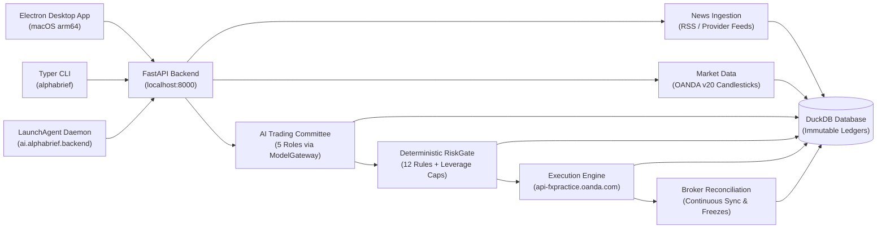
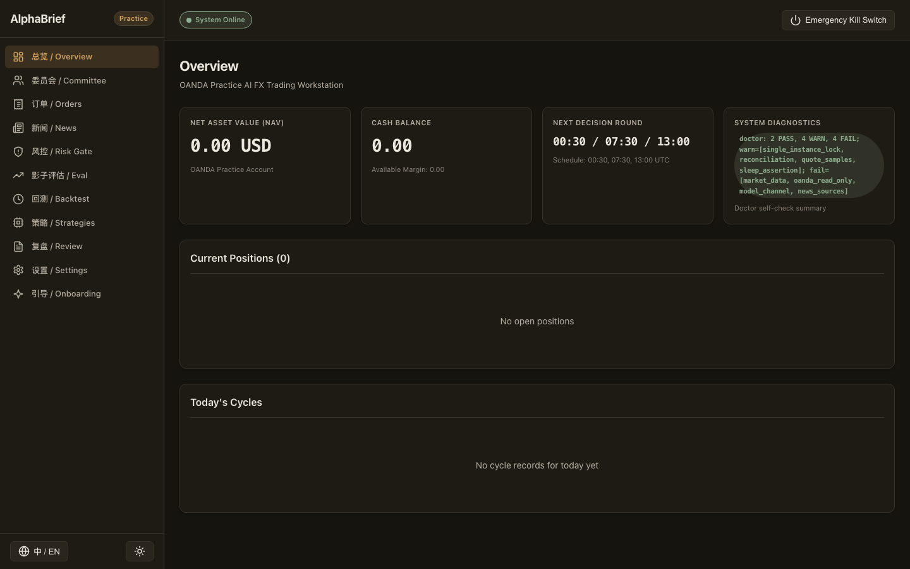
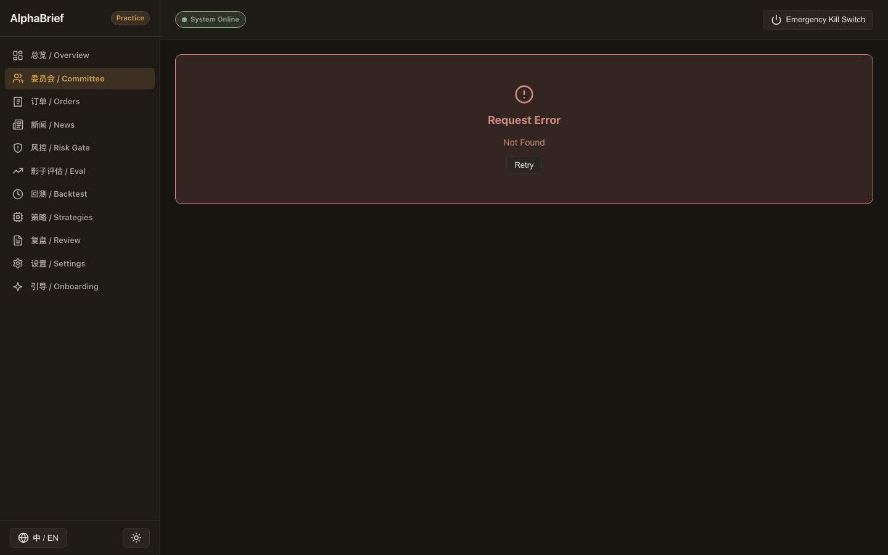
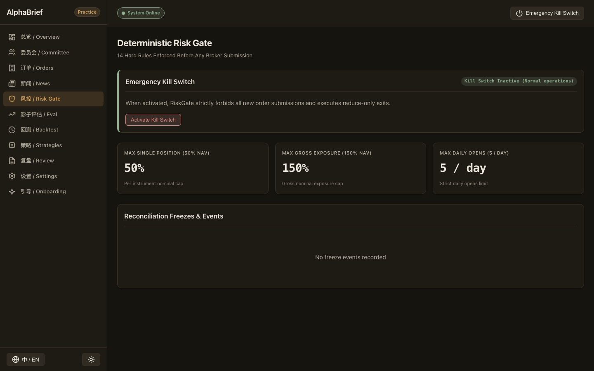
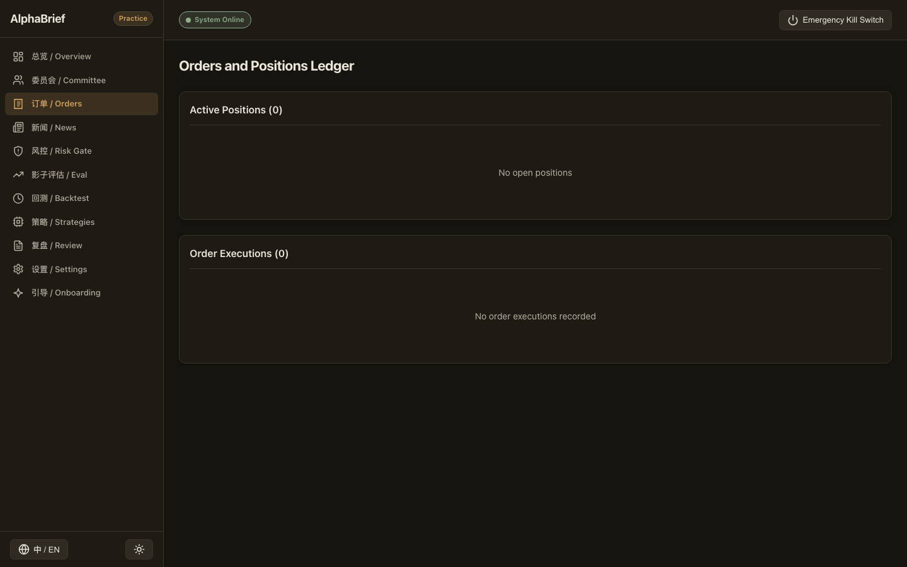

# AlphaBrief

AlphaBrief is a local-first, unattended AI foreign exchange (forex) paper-trading workbench running on **OANDA v20 practice**.

It combines real-time multi-source market and news feeds, a five-role structured AI Trading Committee, deterministic risk controls, idempotent trade submission with protective stop-loss/take-profit orders, continuous broker reconciliation, and automated daily reporting.

[](LICENSE)
[](pyproject.toml)
[](#safety-invariants)


```mermaid
flowchart LR
    E["Electron Desktop App<br/>(macOS arm64)"] --> API["FastAPI Backend<br/>(localhost:8000)"]
    CLI["Typer CLI<br/>(alphabrief)"] --> API
    DAEMON["LaunchAgent Daemon<br/>(ai.alphabrief.backend)"] --> API

    API --> NEWS["News Ingestion<br/>(RSS / Provider Feeds)"]
    API --> MARKET["Market Data<br/>(OANDA v20 Candlesticks)"]
    API --> COMMITTEE["AI Trading Committee<br/>(5 Roles via ModelGateway)"]
    
    COMMITTEE --> RISK["Deterministic RiskGate<br/>(12 Rules + Leverage Caps)"]
    RISK --> EXEC["Execution Engine<br/>(api-fxpractice.oanda.com)"]
    EXEC --> RECON["Broker Reconciliation<br/>(Continuous Sync & Freezes)"]

    NEWS --> DB[("DuckDB Database<br/>(Immutable Ledgers)")]
    MARKET --> DB
    COMMITTEE --> DB
    RISK --> DB
    EXEC --> DB
    RECON --> DB
```

---

## Key Features

1. **Unattended Daemon Operation**
   Runs as a persistent macOS LaunchAgent service (`ai.alphabrief.backend`) with health monitoring, automatic recovery, and exclusive process locks (`runtime.lock`).

2. **Five-Role AI Committee**
   A structured decision pipeline comprising Macro Analyst, Fundamental Analyst, Quantitative Technical Analyst, Risk Officer, and Portfolio Manager. Outputs follow strict JSON schemas with evidence validation and automatic structured repair loops.

3. **Deterministic Risk Controls**
   Strict pre-trade validation enforcing NAV leverage caps (50% max single-trade notional, 150% total exposure), daily drawdown limits, volatility ceilings, and 24-hour consecutive loss circuit breakers.

4. **Emergency Protections & Kill Switch**
   Automatic liquidation latch (`soak_halted`) triggered if portfolio NAV drawdown reaches 5%. Persistent kill switch refuses all new risk exposure while allowing reduce-only order exits.

5. **Two-Way Broker Reconciliation**
   Continuous automated reconciliation of cash balances, active orders, trade fills, and open positions against OANDA practice. Any unexplained discrepancy halts new position opening immediately.

6. **Local-First & Privacy Preserving**
   Powered by an embedded DuckDB database with versioned schema migrations. All API keys and account numbers are strictly scrubbed and redacted across all logs, telemetry, and reports.

---

## Interface Overview

| Overview Dashboard | AI Committee Decision |
|:---:|:---:|
|  |  |

| Deterministic Risk Gate | Execution & Orders |
|:---:|:---:|
|  |  |

---

## Installation & Setup

### Option 1: macOS Desktop Application (`.dmg`)

Download the release `.dmg` from the GitHub Releases page:

1. Open `AlphaBrief-1.0.0-rc.1-arm64.dmg` and drag `AlphaBrief.app` to your `/Applications` folder.
2. **First-time launch on macOS (Unsigned App)**:
   - Because the release binary is self-built and unsigned, macOS Gatekeeper may show a warning: *"AlphaBrief cannot be opened because the developer cannot be verified"*.
   - To open: Right-click (or Control-click) `AlphaBrief.app` in `/Applications` and select **Open**, then click **Open** in the confirmation dialog.
   - Alternatively, navigate to **System Settings** -> **Privacy & Security**, scroll down to the Security section, and click **Open Anyway**.
3. In the Settings tab, input your OANDA practice token and practice account ID.

### Option 2: Run from Source / Developer Mode

Requires Python 3.12+ on macOS.

```bash
# Clone repository
git clone https://github.com/JeremyL691/AlphaBrief.git
cd AlphaBrief

# Create virtual environment and install dependencies
python3.12 -m venv .venv
source .venv/bin/activate
pip install -e '.[dev]'

# Configure OANDA practice credentials
cp .env.example .env
# Edit .env with your ALPHABRIEF_OANDA_TOKEN and ALPHABRIEF_OANDA_ACCOUNT_ID
```

---

## Common CLI Commands

AlphaBrief provides a unified command-line tool `alphabrief`:

```bash
# System diagnostics and health check
.venv/bin/alphabrief doctor run

# Start API server and web dashboard
.venv/bin/alphabrief serve serve --port 8000

# Install and start resident background service
.venv/bin/alphabrief service install --trading-mode on
.venv/bin/alphabrief service status

# Inspect scheduler heartbeats and broker status
.venv/bin/alphabrief scheduler heartbeats
.venv/bin/alphabrief broker status

# Inspect soak testing qualification status
.venv/bin/alphabrief soak status

# Generate operator reports
.venv/bin/alphabrief report daily
.venv/bin/alphabrief report soak
```

---

## Safety Invariants

AlphaBrief enforces strict safety guarantees:

1. **Practice Environment Only**: Execution code is strictly restricted to `api-fxpractice.oanda.com` and `stream-fxpractice.oanda.com`. No live URLs, switches, or production broker toggles exist in the codebase.
2. **Deterministic Pre-Trade Gate**: Every trade order follows the immutable pipeline: `Decision -> OrderIntent -> RiskGate -> Persisted RiskDecision -> OANDA`.
3. **At-Most-Once Execution**: Idempotency keys prevent duplicate order execution upon retries, network hiccups, or service restarts.
4. **No Unauthenticated Execution**: If credentials or input quality checks fail, the system fails closed gracefully to `no_trade`.
5. **Strict Credential Scrubbing**: Full account identifiers and secrets are never printed to logs, displayed in user interfaces, or included in exported reports.

---

## 中文说明 (Chinese Overview)

AlphaBrief 是一款专为 **OANDA v20 模拟盘（practice）** 设计的本地优先（Local-First）AI 外汇无人值守量化交易工作站。

### 核心特性
- **无人值守守护进程**：通过 macOS LaunchAgent（`ai.alphabrief.backend`）常驻后台平稳运行，配备进程独占锁与崩溃自恢复机制。
- **5 角色 AI 投资委员会**：包含宏观分析师、基本面分析师、量化技术分析师、风控专员和投资组合经理，遵循确定性结构化决策协议与自动模式修复。
- **确定性风控门禁（RiskGate）**：执行 12 项入场与仓位约束，包含 NAV 杠杆上限、日内最大回撤限制与连续亏损冷却期。
- **紧急熔断与回撤自平仓**：当账户净值较峰值回撤达到 5% 时，系统永久置入 `soak_halted` 状态并自动清空持仓。
- **实时双向对账**：每分钟与 OANDA 模拟盘对齐现金、订单与持仓流水；出现无法解释的差异时立即冻结新开仓权限。
- **安全不变量保障**：代码库永远不包含任何实盘交易地址或切换开关，所有凭证与账户信息全链路脱敏。

### macOS 未签名应用首次打开方法
若从 Release 下载的 DMG 安装后提示“无法打开，因为无法验证开发者”：
1. 打开“应用程序”文件夹，右键（或按住 Control 键点按）`AlphaBrief.app`，点击**打开**；
2. 在弹出的系统对话框中点击**打开**即可正常运行；
3. 或前往 macOS **系统设置** -> **隐私与安全性**，找到安全性提示并点击**仍要打开**。

---

## Disclaimer

AlphaBrief is research and engineering software developed exclusively for paper-trading practice. It is not financial advice. Past performance on practice market data does not guarantee future results.